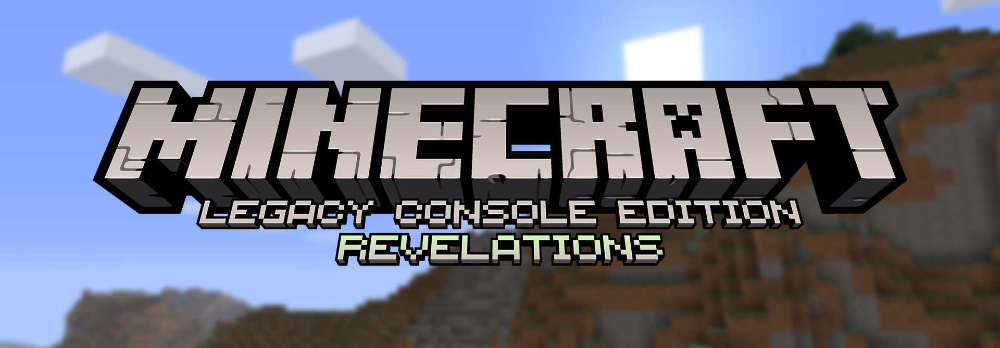
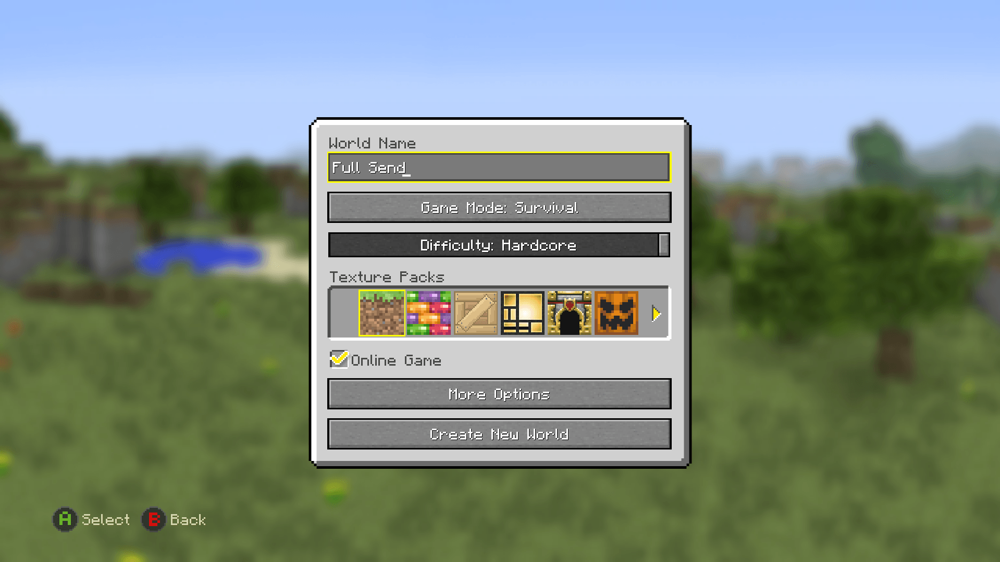
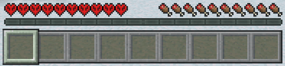

# Legacy Console Edition Revelations

If you have any questions regarding this fork, this is my Fluxer server (similar to a Discord server):
<p align="center">
  <a href="https://fluxer.gg/CgS3uFT7">
    
  </a>
</p>

This project is based on Legacy Console Edition v1.6.0560.0 (TU19) with fixes and improvements applied. Among these, LCE-Revelations features:

- Fully stable from game-start to endgame
- Dedicated server with token-based authentication and encrypted traffic
- Hardcore Mode
- Keyboard & mouse support
- Uncapped FPS via a VSync toggle
- Performance optimizations
- Screenshots
- Multi-language text input
- Copy & paste support
- DNS SRV record support
- In-world player list
- Linux cross-compilation
- FourKit plugin support



## Latest:

### Join Flow Kick Fix

- Fixed newly whitelisted players being insta-kicked on their first connection attempt, then kicked again around 20 seconds into their second attempt. Two separate bugs were colliding: a stale cancel flag left over from the earlier "not whitelisted" rejection screen, and an orphaned login session on the server that would fire a late disconnect packet into a recycled player slot once its 30-second login timer expired

### Fullscreen and Frame Rate Fixes

- Fullscreen (Alt+Enter / F11) now enters true DXGI exclusive fullscreen instead of borderless. With VSync off, your frame rate is actually uncapped and delivered straight to the display, which means noticeably lower input latency on high-refresh monitors
- The game now renders at your monitor's native resolution with no driver-side scaling, removing the soft / grey filter look that borderless mode produced
- Fixed a black-screen regression on secured dedicated servers, where the new swap chain configuration conflicted with the 4J render library's deferred context
- Fixed aspect ratio scaling so non-16:9 window sizes draw the world correctly again

### Controller Cursor Speed

- Fixed controller cursor speed scaling with frame rate. Your cursor now moves at the same speed whether you're at 60fps or 500fps, instead of becoming unusably fast at high frame rates

### Dedicated Server Stability Fixes

- Fixed crashes caused by concurrent access to the player list during multiplayer. The players vector is now protected by a critical section, and all iterations use copy-on-read snapshots to prevent iterator invalidation when players join or leave mid-tick
- Fixed a null pointer crash in the movement validation handler when a player's bounding box was accessed during removal
- Fixed a race condition in network socket writes where a disconnecting player's network reference could become invalid between validation and use
- Fixed a deadlock in the player disconnect path by replacing inline cleanup with a queued disconnect system that is drained safely on the main tick thread
- Disabled Windows QuickEdit mode on the server console to prevent the process from freezing until console input is received

### Beacon Menu Fixes

- Fixed the beacon consuming a payment item (emerald, diamond, iron ingot, or gold ingot) when pressing the submit checkmark without changing any powers
- Fixed beacon menu options appearing greyed out or disappearing entirely after re-entering the menu or on servers, caused by beacon data packets arriving before the client had the menu ready
- Added continuous sync of beacon levels and powers to clients, so changes to the beacon pyramid are reflected while the menu is open
- Fixed beacon effect buttons not visually updating on menu re-entry due to uninitialized UI state from reused heap memory

### Linux Cross-Compilation Support

- The project can now be built from Linux, cross-compiling to Windows
- See [COMPILE.md](COMPILE.md) for setup instructions

### FourKit Plugin Support

- Added a server-side plugin system (`Minecraft.Server.FourKit`) that lets you extend the dedicated server with plugins written in C# / .NET
- Plugins are regular .NET class libraries loaded at server startup. See `samples/HelloPlugin` for a minimal example

### Chunk Loading Optimization (Dedicated Server)

- The dedicated server now processes up to 16 chunk add requests per player per tick (up from 1), improving tick recovery time after player join
- Chunks are still loaded nearest-first to prioritize the area around the player

### Upstream Merges

- fix: boat player height and sneak height (#1459)
- fix: nether portal validation when obsidian exists on both axes (#1337)
- fix: wither and ender dragon custom names now show in boss bar (#1472)
- optimization: remove redundant lastTime setter in tick loop (#1479)
- Docker: configurable SERVER_PORT/SERVER_BIND_IP, timezone and image fixes (#1454, #1457)

### Render-Distance-Independent Player List

- The Tab player list now shows all players on the server regardless of render distance. Previously, the player list was tied to entity tracking -- players only appeared in Tab when their entity was within render distance, and disappeared when they moved out of range
- The fix uses custom payload channels (`MC|ForkHello`, `MC|ForkPLeave`) to signal server identity and player disconnects, so the client can distinguish "player went out of range" from "player left the server." Entity despawns no longer clear the IQNet slot; only an explicit disconnect signal does
- Fully backwards-compatible: no existing packet wire formats are changed. Upstream clients ignore the unknown channels, and fork clients connecting to upstream servers fall back to the old entity-tracking-based behavior

### Graphics Settings Menu Fixes

- Fixed keyboard/gamepad navigation skipping VSync, Fullscreen, and Render Distance options. The SWF focus chain only linked the original console controls; added C++ post-init rewiring of `m_objNavDown`/`m_objNavUp` via Iggy so all controls are reachable
- Shifted the graphics menu layout up by 60 pixels for better vertical centering
- Fixed skin preview walking and attack animations running too fast with VSync off. The per-frame animation increments now scale by delta time relative to a 60fps baseline

### Async Autosave (Dedicated Server)

- Autosave no longer freezes the server. Previously, every autosave compressed the entire world save file with zlib synchronously on the main thread, blocking all game ticks for 2-6 seconds depending on world size
- The save buffer is now snapshotted (memcpy) while holding the save lock, then compression runs on a detached background thread. Once compression finishes, the result is committed back to StorageManager on the next main-thread tick via `flushPendingBackgroundSave()`. StorageManager is not thread-safe, so the actual write is always dispatched from the main thread
- Pending background saves are drained during server shutdown so no save data is lost
- From upstream PR #1473

### Dedicated Server Entity Tracking Optimization

- Eliminated unnecessary O(players^2 * entities) split-screen system-mate checks in the entity tracker on dedicated servers. The `EntityTracker::tick()`, `TrackedEntity::isVisible()`, and `TrackedEntity::broadcast()` functions all contained loops that called `IsSameSystem()` to support console split-screen couch co-op visibility expansion. On dedicated servers, all players are remote, so `IsSameSystem()` always returns false and these loops did nothing but waste CPU every tick
- With 2+ players and hundreds of entities, this removes thousands of redundant comparisons per tick, improving TPS scaling under load
- The original split-screen logic is fully preserved for game client LAN hosting

### Security Gate Hotfix (Dedicated Server)

- Fixed a critical bug where the security gate (packet buffer) was closed before the LoginPacket was sent during `placeNewPlayer`. Under high-latency connections (e.g. players connecting through tunnels or from distant regions), the LoginPacket and all login setup packets were buffered behind the cipher handshake. When the handshake completed and the gate flushed, game data arrived before the player object was initialized, causing a null pointer crash on the client
- The security gate now closes after the login sequence and MC|CKey are sent, so essential setup packets arrive in plaintext before the cipher handshake completes
- **Server owners must update their dedicated server binary to this version.** Players connecting to an updated server must also use the updated client (LCE Revelations builds that include the cipher handshake support)

### Uncapped FPS (VSync Off)

- FPS is no longer locked to the monitor's refresh rate when VSync is disabled. The precompiled 4J render library hardcodes `SyncInterval=1` in its Present call, which forced VBlank synchronization regardless of the VSync setting. The main loop now bypasses the library's Present and calls the DXGI swap chain directly with `SyncInterval=0` and `DXGI_PRESENT_ALLOW_TEARING` when VSync is off
- Pressing F11 to toggle fullscreen now correctly syncs the Fullscreen checkbox in the graphics settings menu

### Graphics Settings Fixes

- The graphics menu layout has been fixed: the render distance slider is now no longer occluded by the gamma slider. Also, resolved spacing error for the checkbox options due to an incomplete removal of the Bedrock Fog toggle option (the setting has been reinstated).

### Hardcore Hearts



- Worlds in hardcore mode now display the hardcore heart textures, matching Java Edition
- Supports all heart states: normal, poison, wither, and flash/blink animations
- Works across all contexts: offline worlds, online hosted worlds, and dedicated servers
- Game mode is locked to Survival when hardcore is enabled in the world creation and load screens

### Dedicated Server Security Hardening

The dedicated server now includes a comprehensive security system to protect against packet-sniffing attacks, XUID harvesting, privilege escalation, and bot flooding. All features are configurable in `server.properties`. Compatible with [playit.gg](https://playit.gg) -- enable `proxy-protocol=true` in your server.properties and enable PROXY Protocol v1 in your playit.gg tunnel settings to get per-player IP tracking, IP bans, and per-player rate limiting.

**What's protected:**
- Player identities (XUIDs) are hidden from unauthenticated connections
- All game traffic is encrypted between secured clients and the server
- When `require-secure-client` and `enable-stream-cipher` are both enabled, old/unpatched clients are blocked before receiving any game data
- Server commands and privileges require persistent `ops.json` authorization
- Connection flooding is rate-limited per IP
- When `require-challenge-token` is enabled, returning players are verified with a persistent identity token

**New `server.properties` keys:**

| Key | Default | Description |
|-----|---------|-------------|
| `enable-stream-cipher` | `true` | Encrypt all game traffic with AES-128-CTR |
| `require-secure-client` | `true` | Kick clients that don't complete the cipher handshake (blocks old clients) |
| `require-challenge-token` | `false` | Require identity token verification to prevent XUID impersonation |
| `proxy-protocol` | `false` | Parse PROXY protocol v1 headers for real client IPs behind a tunnel |
| `hide-player-list-prelogin` | `true` | Strip player XUIDs from the pre-login response |
| `rate-limit-connections-per-window` | `5` | Max TCP connections per IP within the rate limit window |
| `rate-limit-window-seconds` | `30` | Sliding window duration for rate limiting |
| `max-pending-connections` | `10` | Max simultaneous pre-login connections |

**Recommended setup (especially for playit.gg):**

```properties
enable-stream-cipher=true
require-secure-client=true
require-challenge-token=true
proxy-protocol=true
```

**New server commands:**

| Command | Description |
|---------|-------------|
| `whitelist add <name>` | Whitelist a player by name (they must attempt to connect once first) |
| `revoketoken <name>` | Revoke a player's identity token (use if a player lost their token) |

**Server logging:**
- A `server.log` file is now written alongside the server executable
- Security events appear in the CLI with `[security]` tags
- Each join shows a security summary: cipher status, token status, XUID, and real IP

**Important:** When `require-secure-client=true` and `enable-stream-cipher=true`, only the secured client (`LCE-Revelations-Client-Win64.zip`) can connect. Old/upstream clients will be blocked before receiving any game data. Set both to `false` if you want to allow all clients.

### Player List Map Icon Color Fix

- The colored map icon shown next to each player in the tab player list and teleport menu now matches their actual map marker color. Previously the icon was determined by a broken small-ID lookup that produced incorrect colors. The icon is now computed client-side using the same hash the map renderer uses, keyed by player name for reliable lookup

### End Dimension Fixes for Dedicated Servers

- Fixed the Ender Dragon being immune to melee damage on dedicated servers. The server's entity ID allocator (smallId pool) assigned non-sequential IDs to the dragon's body parts, but the client assumed sequential offsets. Melee attacks targeted IDs the server didn't recognize, so hits were silently dropped. The server now reassigns sub-entity IDs to be sequential from the parent when an entity with parts is added to the level
- Fixed entering the End exit portal after defeating the dragon crashing the game. The player entity was never added to the Overworld level during the dimension transition, leaving the player as a ghost entity that caused a crash on the next interaction
- Fixed the End Poem crashing the client on dedicated servers due to an out-of-bounds player index lookup in the WIN_GAME event handler

### Dedicated Server Player List Fix

- The Tab player list now correctly shows all connected players on dedicated servers. Previously only the local player was visible because remote players were never registered in the client's network player tracking when their `AddPlayerPacket` arrived
- The dedicated server's phantom host entry (slot 0, empty name) is now filtered from the list
- ~~Players are properly removed from the list when they disconnect, using gamertag matching since dedicated server XUIDs are not available on the client~~ This initial implementation incorrectly tied IQNet cleanup to entity removal (`RemoveEntitiesPacket`), which is sent both when a player goes out of render distance and when they disconnect. This caused players to disappear from the Tab list whenever they moved out of tracking range. Fixed in the "Render-Distance-Independent Player List" update above

### SRV Record Support and Async Join Refactor

- Added DNS SRV record resolution (`_minecraft._tcp.<hostname>`), matching Java Edition behavior. Players can connect using just a domain name (e.g. `play.example.com`) and the client will automatically look up the correct server address and port from DNS
- Refactored the async server joining system: replaced boolean flags with a clean `eJoinState` enum state machine, moved connection progress handling into a dedicated `UIScene_ConnectingProgress` class with attempt counter and cancel support, and added a `FinalizeJoin()` separation so the recv thread only starts after the UI confirms success

### Piston Fix for Dedicated Servers

- Fixed a bug where pistons would permanently break server-wide on dedicated servers when a redstone clock ran long enough. The piston update lock (`ignoreUpdate`) was set at the start of `triggerEvent` but never cleared on three early-return paths, permanently blocking all piston neighbor updates for the rest of the session. A fast clock would eventually hit one of these paths (e.g. signal state changing between event queuing and processing), locking out every piston in the world

### Chunk Unloading and Connection Stability Fixes

- Fixed a regression where chunks outside the player's immediate vicinity would fail to load on dedicated servers, leaving giant missing areas. The server's chunk drop function was immediately removing chunks from the cache instead of queuing them for the existing save/unload pipeline, which meant chunks were never saved, never moved to the recovery cache, and their entities (item frames, paintings, etc.) were never removed from the level before being reloaded, causing entity duplication
- Fixed the server's `dropAll()` and autosave chunk cleanup iterating the loaded chunk list while simultaneously modifying it (undefined behavior that could corrupt chunk tracking or stall the server)
- Removed an overly aggressive `dropAll()` call that wiped the entire chunk cache whenever render distance decreased, instead of only removing the out-of-range chunks
- Fixed a client-side connection bug where a 5-second socket recv timeout (used during the initial server handshake) was never cleared after connecting. This meant any brief server pause longer than 5 seconds (e.g. autosave, chunk I/O) would cause the client to interpret the silence as a lost connection and disconnect

### Dedicated Server Biome Diversity Fix

- The dedicated server previously used a completely random seed with no biome diversity checks, unlike the client which validates seeds to guarantee varied biomes. This could result in server worlds with large regions dominated by only one or two biome types (e.g. all taiga/snowy)
- On top of that, the client's seed validation was hardcoded to only check a 54-chunk (Classic) area, so even validated seeds had no diversity guarantee beyond that. This made the problem especially noticeable on Large worlds or worlds expanded from Classic to Large
- New server worlds now validate seeds for biome diversity, and the validation scales to the full target world size
- Added `override-seed` in server.properties to fix existing worlds without deleting them. Set it to any seed number and newly generated chunks will use it instead of the original

### Server List and Connection Improvements

- Server edits and deletions now apply immediately without needing to restart the game
- Connecting to an offline/unreachable server no longer freezes the game indefinitely
- Connection attempts use non-blocking sockets with a 5-second timeout (3 retries max) instead of the OS TCP timeout
- Connection runs on a background thread so the UI stays responsive, with a cancel option (press B or Escape) to back out at any time
- Failed connections now always show a "Connection Failed" dialog instead of silently navigating back

### Upstream Merge

- Fixed font rendering for color and formatting codes, splash text like "Colormatic!" now renders with proper per-character colors
- Fixed Sign editing UI, SignEntryMenu720 restored to correct version
- Stained glass and stained glass panes are now craftable in survival mode with full crafting UI support
- Clicking outside a container inventory while holding an item now drops it, matching Java Edition behavior
- Item lore text now displays on hover for items with NBT lore data
- Increased entity limits: boats 40->60, minecarts 40->60, fireballs 200->300, projectiles 300->400
- Fixed missing trapped chest textures in Natural Texture Pack
- Debug packet handling now properly gated behind debug builds

### Music Context Fixes

- Menu music (menu1-4) now plays only on the title screen
- Creative music (creative1-6) only plays in creative mode
- Survival mode plays only calm/hal/nuance/piano tracks

### Performance Optimizations

- Renderer: column-level frustum culling and compact visible-chunk lists skip thousands of empty iterations per frame; lightweight second-pass render path avoids redundant checks
- Sound engine: filesystem probe results are now cached, eliminating repeated file-existence checks every time a sound plays; sounds are pre-decoded for smoother playback
- Entity movement: reduced `shared_from_this()` overhead by caching the shared pointer; `dynamic_pointer_cast` replaced with a raw pointer cast guarded by `instanceof`
- Chunk updates: early-out for non-dirty chunks in the update loop; scaled recheck period at high render distances
- Threading: entity query locking consolidated at the `Level` layer on all platforms for consistent thread safety
- Block breaking: server now skips redundant tile-update packets when a block is successfully destroyed

### CMake Build System Migration

- Project now builds with CMake instead of Visual Studio project files
- Use `cmake --preset windows64` or open the repo folder directly in Visual Studio (it detects `CMakeLists.txt` automatically)
- Old `.vcxproj`/`.sln` files are preserved on the `vs-build` branch if needed

### Multi-Language Font Rendering and Unicode Text Input

- Type and read text/characters in Japanese, Chinese, Korean, Thai, Arabic, Hindi, and many more languages
- Works in: chat, signs, world names, seeds, server address/port fields
- Two rendering systems: Iggy UI uses a new unicode bitmap fallback font; legacy C++ renderer uses Java Minecraft's glyph page system
- Arabic text shaping: proper contextual letter forms and right-to-left visual reordering in chat and UI
- Security: blocked Unicode bidirectional override characters to prevent chat spoofing
- Fixed a pre-existing memory leak in sign loading

### Copy+Paste Support

- Added copy+paste support for IP/Port, world names, world seeds, server names, signs, etc.
- Just use Ctrl+V to paste from your clipboard

### Dedicated Server Hardcore Mode

- Dedicated server is fully compatible with `smartcmd/MinecraftConsoles` clients, even with hardcore mode
- Client (`LCE-Revelations-Client-Win64.zip`): download from the Nightly release on GitHub
- Dedicated Server (`LCE-Revelations-Server-Win64.zip`): download from the Nightly-Dedicated-Server release on GitHub
- Docker: pull `ghcr.io/itsrevela/lce-revelations-dedicated-server:nightly` for server container

### Screenshot Functionality

- Pressing F2 will save a screenshot to a `screenshots` folder in your root game directory
- Works in any context: main menu, pause menu, settings, inventory, crafting, and during gameplay
- A local-only chat message is shown to the player when in-game

Proper implementation of Hardcore Mode in LCE Revelations!
- difficulty slider included in create world menu
- difficulty slider forces "Difficulty: Hardcore" on world load
- singleplayer: host death, force no respawn, on exit deletes world
- multiplayer: host death = world delete upon exit --- joiner death = only exit available, persists upon rejoin (no respawn option)
- multiplayer fixes: added fix to prevent host from using exit-without-saving loophole for nonhost players that died
- to-do: hardcore hearts texture

The current goal of LCE-Revelations is to be a multi-platform base for further development, such as modding, backports, and anything else LCE. On top of that, we're working to make this a quality experience on Desktop with or without a controller while (long-term) retaining console support. 

See our our [Contributor's Guide](./CONTRIBUTING.md) for more information on the goals of this project.

## Download
### Client
Windows users can download our [Nightly Build](https://github.com/itsRevela/LCE-Revelations/releases/tag/Nightly)! Simply download the `.zip` file and extract it to a folder where you'd like to keep the game. You can set your username in `username.txt` (you'll have to make this file)
### Server
If you're looking for Dedicated Server software (with hardcore-mode functionality), download its [Nightly Build here](https://github.com/itsRevela/LCE-Revelations/releases/tag/Nightly-Dedicated-Server). Similar instructions to the client more or less, though see further down in this README for more info on that.

## Platform Support

- **Windows**: Supported for building and running the project
- **macOS / Linux**: The Windows nightly build will run through Wine or CrossOver based on community reports, but this is unofficial and not currently tested by the maintainers when pushing updates
- **Android**: VIA x86 EMULATORS (like GameNative) ONLY! The Windows nightly build does run but has stability / frametime pacing issues frequently reported
- **iOS**: No current support
- **All Consoles**: Console support remains in the code, but maintainers are not currently verifying console functionality / porting UI Changes to the console builds at this time.

## Features

- Dedicated Server Software (`Minecraft.Server.exe`)
- Fixed compilation and execution in both Debug and Release mode on Windows using Visual Studio 2022
- Added support for keyboard and mouse input
- Added fullscreen mode support (toggle using F11)
- (WIP) Disabled V-Sync for better performance
- Added a high-resolution timer path on Windows for smoother high-FPS gameplay timing
- Device's screen resolution will be used as the game resolution instead of using a fixed resolution (1920x1080)
- LAN Multiplayer & Discovery
- Added persistent username system via `username.txt`
- Decoupled usernames and UIDs to allow username changes
- Fixed various security issues present in the original codebase
- Splitscreen Multiplayer support (connect to dedicated servers, etc)
- In-game server management (Add Server button, etc)


## Controls (Keyboard & Mouse)

- **Movement**: `W` `A` `S` `D`
- **Jump / Fly (Up)**: `Space`
- **Sneak / Fly (Down)**: `Shift` (Hold)
- **Sprint**: `Ctrl` (Hold) or Double-tap `W`
- **Inventory**: `E`
- **Chat**: `T`
- **Drop Item**: `Q`
- **Crafting**: `C` Use `Q` and `E` to move through tabs (cycles Left/Right)
- **Toggle View (FPS/TPS)**: `F5`
- **Fullscreen**: `F11`
- **Pause Menu**: `Esc`
- **Attack / Destroy**: `Left Click`
- **Use / Place**: `Right Click`
- **Select Item**: `Mouse Wheel` or keys `1` to `9`
- **Accept or Decline Tutorial hints**: `Enter` to accept and `B` to decline
- **Game Info (Player list and Host Options)**: `TAB`
- **Toggle HUD**: `F1`
- **Toggle Debug Info**: `F3`
- **Open Debug Overlay**: `F4`
- **Toggle Debug Console**: `F6`


## Contributors
Would you like to contribute to this project? Please read our [Contributor's Guide](CONTRIBUTING.md) before doing so! This document includes our current goals, standards for inclusions, rules, and more.

## Client Launch Arguments

| Argument           | Description                                                                                         |
|--------------------|-----------------------------------------------------------------------------------------------------|
| `-name <username>` | Overrides your in-game username.                                                                    |
| `-fullscreen`      | Launches the game in Fullscreen mode                                                                |

Example:
```
Minecraft.Client.exe -name Steve -fullscreen
```

## LAN Multiplayer
LAN multiplayer is available on the Windows build

- Hosting a multiplayer world automatically advertises it on the local network
- Other players on the same LAN can discover the session from the in-game Join Game menu
- Game connections use TCP port `25565` by default
- LAN discovery uses UDP port `25566`
- Add servers to your server list with the in-game Add Server button (temp)
- Rename yourself without losing data by keeping your `uid.dat`
- Split-screen players can join in, even in Multiplayer

# Dedicated Server Software

## About `server.properties`

`Minecraft.Server` reads `server.properties` from the executable working directory (Docker image: `/srv/mc/server.properties`).
If the file is missing or contains invalid values, defaults are auto-generated/normalized on startup.

Important keys:

| Key | Values / Range | Default | Notes |
|-----|-----------------|---------|-------|
| `server-port` | `1-65535` | `25565` | Listen TCP port |
| `server-ip` | string | `0.0.0.0` | Bind address |
| `server-name` | string (max 16 chars) | `DedicatedServer` | Host display name |
| `max-players` | `1-8` | `8` | Public player slots |
| `level-name` | string | `world` | Display world name |
| `level-id` | safe ID string | derived from `level-name` | Save folder ID; normalized automatically |
| `level-seed` | int64 or empty | empty | Empty = random seed |
| `world-size` | `classic\|small\|medium\|large` | `classic` | World size preset for new worlds and expansion target for existing worlds |
| `log-level` | `debug\|info\|warn\|error` | `info` | Server log verbosity |
| `autosave-interval` | `5-3600` | `60` | Seconds between autosaves |
| `white-list` | `true/false` | `false` | Enable access list checks |
| `lan-advertise` | `true/false` | `false` | LAN session advertisement |

Minimal example:

```properties
server-name=DedicatedServer
server-port=25565
max-players=8
level-name=world
level-seed=
world-size=classic
log-level=info
white-list=false
lan-advertise=false
autosave-interval=60
```

## Dedicated Server launch arguments

The server loads base settings from `server.properties`, then CLI arguments override those values.

| Argument | Description |
|----------|-------------|
| `-port <1-65535>` | Override `server-port` |
| `-ip <addr>` | Override `server-ip` |
| `-bind <addr>` | Alias of `-ip` |
| `-name <name>` | Override `server-name` (max 16 chars) |
| `-maxplayers <1-8>` | Override `max-players` |
| `-seed <int64>` | Override `level-seed` |
| `-loglevel <level>` | Override `log-level` (`debug`, `info`, `warn`, `error`) |
| `-help` / `--help` / `-h` | Print usage and exit |

Examples:

```powershell
Minecraft.Server.exe -name MyServer -port 25565 -ip 0.0.0.0 -maxplayers 8 -loglevel info
Minecraft.Server.exe -seed 123456789
```

## Dedicated Server in Docker (Wine)

This repository includes a lightweight Docker setup for running the Windows dedicated server under Wine.
### Quick Start (No Build, Recommended)

No local build is required. The container image is pulled from GHCR.

```bash
./start-dedicated-server.sh
```

`start-dedicated-server.sh` does the following:
- uses `docker-compose.dedicated-server.ghcr.yml`
- pulls latest image, then starts the container

If you want to skip pulling and just start:

```bash
./start-dedicated-server.sh --no-pull
```

Equivalent manual command:

```bash
docker compose -f docker-compose.dedicated-server.ghcr.yml up -d
```

### Local Build Mode (Optional)

Use this only when you want to run your own locally built `Minecraft.Server` binary in Docker.
**A local build of `Minecraft.Server` is required for this mode.**

```bash
docker compose -f docker-compose.dedicated-server.yml up -d --build
```

Useful environment variables:
- `XVFB_DISPLAY` (default: `:99`)
- `XVFB_SCREEN` (default: `64x64x16`, tiny virtual display used by Wine)

Fixed server runtime behavior in container:
- executable path: `/srv/mc/Minecraft.Server.exe`
- bind IP: `0.0.0.0`
- server port: `25565`

Persistent files are bind-mounted to host:
- `./server-data/server.properties` -> `/srv/mc/server.properties`
- `./server-data/GameHDD` -> `/srv/mc/Windows64/GameHDD`


## Build & Run

1. Install [Visual Studio 2022](https://aka.ms/vs/17/release/vs_community.exe) or [newer](https://visualstudio.microsoft.com/downloads/).
2. Clone the repository.
3. Open the project folder from Visual Studio.
4. Set the build configuration to **Windows64 - Debug** (Release is also ok but missing some debug features), then build and run.

### CMake (Windows x64)

```powershell
cmake --preset windows64
cmake --build --preset windows64-debug --target Minecraft.Client
```

For more information, see [COMPILE.md](COMPILE.md).

## Star History

[](https://www.star-history.com/?spm=a2c6h.12873639.article-detail.7.7b9d7fabjNxTRk#MCLCE/MinecraftConsoles&type=date&legend=top-left)
