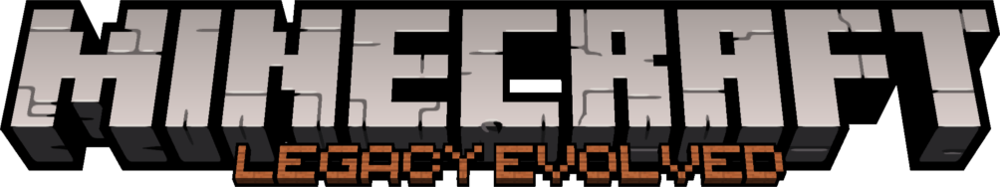

 
# Legacy Evolved
This project aims to backport the newer title updates back to the Minecraft: Legacy Console Edition Source Code Leak (which is based on TU19).

# Our roadmap:

- Port Title Update 25 (98.21% complete)

- Port Title Update 31 (67.16% complete)

See our our [Contributor's Guide](./CONTRIBUTING.md) for more information on the goals of this project.

# Download
Users can download our [Nightly Build](https://github.com/piebotc/LegacyEvolved/releases/tag/nightly)! Simply download the `.zip` file and extract it!

## Build & Run

1. Install [Visual Studio 2022](https://aka.ms/vs/17/release/vs_community.exe) or [newer](https://visualstudio.microsoft.com/downloads/).
2. Clone the repository.
3. Open the project folder from Visual Studio.
4. Set the build configuration to **Windows64 - Debug** (Release is also ok but missing some debug features), then build and run.
